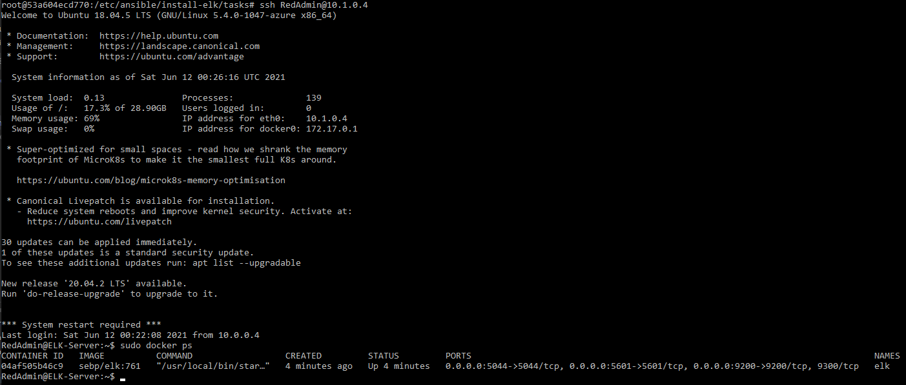

# ELK Stack Deployment with Azure Virtual Network

The files in this repository were used to configure the network depicted below.


These files have been tested and used to generate a live ELK deployment with an Azure container network using ansible. The information provided in this repository can be used to either recreate the entire deployment or install specific portions of the project.

This document contains the following details:

- [Description of the Topology](#Description-of-the-Topology)
- [Access Policies](#Access-Policies)
  - [Network Security Groups](#Network-Security-Groups)
- [ELK Configuration](#ELK-Configuration)
- [Target Machines and Beats](#Target-Machines-and-Beats)
  - [Filebeat](#Filebeat)
  - [Metricbeat](#Metricbeat)
- [Deploy using the Playbook](#Using-The-Playbook)

## Description of the Topology

The main purpose of this network is to utilize a load-balanced and monitored instances of DVWA, the D*mn Vulnerable Web Application.  DVWA is an intentionally exploitable website designed to allow for the most common vulnerabilities. The network included in this repository provides redundancy from these attacks while monitoring the network traffic to expose these common exploits.

A Load Balancer acts as a router by distributing incoming network traffic uniformly across the backend server pool. This ensures that the application will be highly accessible should a server go down. In this instance the Load Balancer is also used to limit access to the web application to our `workstation` for research purposes.

Implementing a Jump Box further restricts internal network exposure to the backend pool by only allowing SSH access with public key authentication to the network by the administrator.  This forces all network traffic to a single node which can be further hardened and monitored for security.

Integrating an ELK server allows users to easily monitor the vulnerable web application for changes to the file systems and system metrics.  Information is collected and analyzed by Kabana through the Elasticsearch engine, Filebeat and Metricbeat are used for logging changes on the web servers to the ELK container.  

All server configuration files were installed using ansible playbooks and are included in this repository.

Configuration details of each machine:

| Name     | Function   | IP Address | Operating System |
|----------|------------|------------|------------------|
| Jump Box | Gateway    | 10.0.0.4   | Linux            |
| DVWA-1   | Web Server | 10.0.0.5   | Linux            |
| DVWA-2   | Web Server | 10.0.0.6   | Linux            |
| DVWA-3   | Web Server | 10.0.0.7   | Linux            |
| ELK      | Monitoring | 10.1.0.4   | Linux            |

## Access Policies

In this deployment only the Jump Box can accept connections from the internet.  Access to the internal network was established through `ssh` with public key authentication to the Jump Box from the `workstation-ip`.  Internally, the only access between the DVWA containers is through the Ansible control node and the `workstation-ip`.  Public key authentication was also established between the Ansible control node and the other containers in the network.

Using Network Security Groups further limited access to the web application by restricting accessibility to TCP network traffic only from the `workstation-ip`.

A summary of the access policies can be found in the table below:

| Name     | Publicly Accessible | Allowed IP Addresses |
|----------|---------------------|----------------------|
| Jumpbox  | Yes                 | 89.187.164.245       |
| DVWA-1   | No                  | 10.0.0.4             |
| DVWA-2   | No                  | 10.0.0.4             |
| DVWA-3   | No                  | 10.0.0.4             |
| ELK      | No                  | 10.0.0.4             |

### Network Security Groups

In this deployment, two seperate Network Security Groups were used to further segment the Azure network.  The Jumpbox, DVWA servers, and Load Balancer were configured under a virtual network with a Network Security Group to set a short list of rules for access control. 

The ELK server and ELK Network Security Group were established under its own dedicated virtual network and subnet with network peering configured to allow traffic to pass between the two virtual networks.

#### Web Servers NSG

With the rules below, the Network Security Group for the web servers denied all traffic while establishing the network and securing the containers.  SSH access is granted to the `workstation-ip` to the Jumpbox, which is the gateway to the internal network, via `Jumpbox_Access` and `SSH_Access` rules.  

With the `Web_Access` rule a dedicated connection through port `80` is granted to the `workstation-ip` which gives the user visibility on the vulnerable web application.

Inbound Security Rules:

| Name           | Port | Protocol | Source         | Destination     |
|----------------|------|----------|----------------|-----------------|
| DenyAllInBound | Any  | Any      | Any            | Any             |
| SSH_Access     | 22   | TCP      | 89.187.164.245 | Any             |
| Jumpbox_Access | 22   | TCP      | 10.0.0.4       | Virtual Network |
| Web_Access     | 80   | TCP      | 89.187.164.245 | Virtual Network |

#### ELK Server NSG

The inbound rule for the ELK Server Network Security Group allows for access to the ELK UI through port `5601` from the `workstation-ip`.  This limits access to the ELK monitoring network that has been configured.  It is recommended that the ELK server Public IP should be set to Dynamic, this will cause the dedicated IP address to change when the virtual machine is booted.  The ELK dashboard can be accessed by typing `[elk.vm.external.ip]:5601/app/kibana` in your browser.

Inbound Security Rules:

| Name       | Port | Protocol | Source         | Destination     |
|------------|------|----------|----------------|-----------------|
| ELK_Access | 5601 | TCP      | 89.187.164.245 | Virtual Network |

## Elk Configuration

Ansible was used to automate configuration of the ELK server, no configurations were performed manually.  Automating configurations with Ansible allows for the repeated and immediate deployment of base configurations.  This also allows for improvements to be made in an immediately deployable instance and updating multiple containers simultaneously.

From your Ansible container:

- Make sure you are in the appropriate directory to run the install-elk.yml playbook by using the `cd` command to the following directory `/etc/ansible/install-elk/`.

  - To run the ansible playbook use the command:
    - `ansible-playbook install-elk.yml`

- Your output on your terminal should like similar to the one below:

```md
root@53a604ecd770:/etc/ansible/install-elk# ansible-playbook install-elk.yml

PLAY [Configure Elk VM with Docker] ****************************************************

TASK [Gathering Facts] *****************************************************************
ok: [10.1.0.4]

TASK [Increase virtual memory] *********************************************************
changed: [10.1.0.4]

TASK [Increase virtual memory on restart] **********************************************
changed: [10.1.0.4]

TASK [Install docker.io] ***************************************************************
changed: [10.1.0.4]

TASK [Install python3-pip] *************************************************************
changed: [10.1.0.4]

TASK [Install Docker module] ***********************************************************
changed: [10.1.0.4]

TASK [download and launch a docker ELK container] **************************************
changed: [10.1.0.4]

TASK [Enable service docker on boot] **************************************
changed: [10.1.0.4]

PLAY RECAP *****************************************************************************
10.1.0.4                   : ok=1    changed=7    unreachable=0    failed=0    skipped=0    rescued=0    ignored=0
```

The ELK playbook implements the following tasks:

- Increases virtual memory required to run an ELK container

- Increases virtual memory on restart

Then installs the following services:

- The Docker image

- Python 3

- The Docker Python pip module

- Then downloads and launches the docker ELK container

Once the installation is complete you'll need to use the command `ssh <username>@<ELK.docker.ip>` to access the newly installed ELK container and run `docker ps` to verify that the container is running.



## Target Machines and Beats

This ELK server is configured to monitor the following machines:

- `10.0.0.5`
- `10.0.0.6`
- `10.0.0.7`

The following Beats were installed on the web servers using playbooks and configuration files similar to the ELK container.  Short descriptions of the Beats and information collected to send to the ELK server are detailed below.  The playbooks have a `curl` command to pull Beats directly from [elastic.co](https://www.elastic.co/downloads/beats/) database, install using the `dpkg` command, and edit the configuration files with the ones included in this repository.

### Filebeat

Filebeat is used to collect and transfer specific log files to the ELK engine.  The configuration file can be changed to harvest various log files tailored to a user defined application.  The modules enabled in the Filebeat configuration file extract logs from the DVWA web servers to be included in the Elasticsearch engine.

Modules that were enabled are Elasticsearch, haproxy, kafka, kibana, nats, osquery, and santa with log input from `/var/log/*.log` and output to Elasticsearch host `10.1.0.4:9200`, as well as loaded via Kibana API through `10.1.0.4:5601`.

- [Filebeat Installation Playbook](Resources/install-filebeat/filebeat.yml)

From your Ansible container:

- Make sure you are in the appropriate directory to run the filebeat.yml playbook by using the `cd` command to the following directory `/etc/ansible/install-filebeat/`.

  - To run the ansible playbook use the command:
    - `ansible-playbook filebeat.yml`

- After completing the Filebeat installation you should have an output similar to the one below:

```md
root@53a604ecd770:/etc/ansible/install-filebeat/tasks# ansible-playbook filebeat.yml

PLAY [Installing and Launch Filebeat] *******************************************************************************

TASK [Gathering Facts] **********************************************************************************************
ok: [10.0.0.7]
ok: [10.0.0.6]
ok: [10.0.0.5]

TASK [Download Filebeat deb] ****************************************************************************************
[WARNING]: Consider using the get_url or uri module rather than running 'curl'.  If you need to use command because
get_url or uri is insufficient you can add 'warn: false' to this command task or set 'command_warnings=False' in
ansible.cfg to get rid of this message.

changed: [10.0.0.7]
changed: [10.0.0.6]
changed: [10.0.0.5]

TASK [Install Filebeat deb] *****************************************************************************************
[WARNING]: Consider using 'become', 'become_method', and 'become_user' rather than running sudo

changed: [10.0.0.7]
changed: [10.0.0.6]
changed: [10.0.0.5]

TASK [Edit Filebeat configuration file] *************************************************************************
changed: [10.0.0.7]
changed: [10.0.0.5]
changed: [10.0.0.6]

TASK [Enable and Configure System Module] ***************************************************************************
changed: [10.0.0.5]
changed: [10.0.0.7]
changed: [10.0.0.6]

TASK [Setup Filebeat] ***********************************************************************************************
changed: [10.0.0.5]
changed: [10.0.0.6]
changed: [10.0.0.7]

TASK [Start Filebeat service] ***************************************************************************************
[WARNING]: Consider using the service module rather than running 'service'.  If you need to use command because service is insufficient you can add 'warn: false' to this command task or set 'command_warnings=False' in ansible.cfg to get
rid of this message.
changed: [10.0.0.5]
changed: [10.0.0.6]
changed: [10.0.0.7]

TASK [Enable Filebeat on boot] **************************************************************************************
changed: [10.0.0.5]
changed: [10.0.0.6]
changed: [10.0.0.7]

PLAY RECAP **********************************************************************************************************
10.0.0.5                   : ok=1    changed=7    unreachable=0    failed=0    skipped=0    rescued=0    ignored=0
10.0.0.6                   : ok=1    changed=7    unreachable=0    failed=0    skipped=0    rescued=0    ignored=0
10.0.0.7                   : ok=1    changed=7    unreachable=0    failed=0    skipped=0    rescued=0    ignored=0
```

### Metricbeat

With Metricbeat, information can be periodically collected about the system or service monitored and sent to Elasticsearch for the data to be stored and analyzed.  Information such as CPU usage, `ssh` login attempts, failed `sudo` escalations, and CPU/RAM statistics are a few system metrics that can give an insight on what is occurring on the target server.  Metricbeat has the ability to use modules that can be used to monitor certain services and systems on different hosts.

Similar to Filebeat, Metricbeat is configured to output data collected to Elasticsearch through `10.1.0.4:9200` and loaded via Kibana API via `10.1.0.4:5601`.

- [Metricbeat Installation Playbook](Resources/install-metricbeat/metricbeat.yml)

From your Ansible container:

- Make sure you are in the appropriate directory to run the metricbeat.yml playbook by using the `cd` command to the following directory `/etc/ansible/install-metricbeat/`.

  - To run the ansible playbook use the command:
    - `ansible-playbook metricbeat.yml`

- Your terminal output should look similar to this:

```md
root@53a604ecd770:/etc/ansible/install-metricbeat/tasks# ansible-playbook metricbeat.yml

PLAY [Install Metricbeat] *******************************************************************************************************************************************************************************************************************

TASK [Gathering Facts] **********************************************************************************************************************************************************************************************************************
ok: [10.0.0.7]
ok: [10.0.0.6]
ok: [10.0.0.5]

TASK [Download Metricbeat] ******************************************************************************************************************************************************************************************************************
[WARNING]: Consider using the get_url or uri module rather than running 'curl'.  If you need to use command because get_url or uri is insufficient you can add 'warn: false' to this command task or set 'command_warnings=False' in
ansible.cfg to get rid of this message.

changed: [10.0.0.5]
changed: [10.0.0.7]
changed: [10.0.0.6]

TASK [Install Metricbeat] *******************************************************************************************************************************************************************************************************************
changed: [10.0.0.7]
changed: [10.0.0.5]
changed: [10.0.0.6]

TASK [Edit Metricbeat Config file] **********************************************************************************************************************************************************************************************************
changed: [10.0.0.5]
changed: [10.0.0.7]
changed: [10.0.0.6]

TASK [Enable and configure docker module] ***************************************************************************************************************************************************************************************************
changed: [10.0.0.5]
changed: [10.0.0.7]
changed: [10.0.0.6]

TASK [Setup Metricbeat] *********************************************************************************************************************************************************************************************************************
changed: [10.0.0.7]
changed: [10.0.0.5]
changed: [10.0.0.6]

TASK [Start Metricbeat] *********************************************************************************************************************************************************************************************************************
[WARNING]: Consider using the service module rather than running 'service'.  If you need to use command because service is insufficient you can add 'warn: false' to this command task or set 'command_warnings=False' in ansible.cfg to get
rid of this message.

changed: [10.0.0.5]
changed: [10.0.0.7]
changed: [10.0.0.6]

TASK [Enable service metricbeat on boot] ****************************************************************************************************************************************************************************************************
changed: [10.0.0.5]
changed: [10.0.0.6]
changed: [10.0.0.7]

PLAY RECAP **********************************************************************************************************************************************************************************************************************************
10.0.0.5                   : ok=1    changed=7    unreachable=0    failed=0    skipped=0    rescued=0    ignored=0
10.0.0.6                   : ok=1    changed=7    unreachable=0    failed=0    skipped=0    rescued=0    ignored=0
10.0.0.7                   : ok=1    changed=7    unreachable=0    failed=0    skipped=0    rescued=0    ignored=0
```

## Using The Playbook

In order to use the playbook, you will need to have an Ansible control node already configured.

`ssh` into the Jumbox from your `workstation-ip` and ensure that your Ansible control node is running with the following command:

- `sudo docker container list -a`

This will bring up the list of containers available through the Jumpbox.  Under the Status column you should read `Up`.  If not run:

- `sudo docker start [container_name]`
  - Your container name will be listed under the `Names` column from the previous command.
- `sudo docker attach [container_name]` to access you Ansible control node.

To use the playbooks, we must perform the following steps:

- Copy the playbooks to the Ansible Control Node
- Run each playbook on the appropriate targets

The easiest way to copy the playbooks is to use `git`:

```md
$ cd /etc/ansible
## Clone Repository + Playbooks
$ git clone https://github.com/marsctx/Azure-ELK-Deployment.git
## Copy Playbooks and hosts file Into `/etc/ansible`
$ cp -r Azure-ELK-Deployment/Resources/* .
## Using `ls` should output the following files and directories
$ ansible.cfg
$ hosts
$ install-elk/
$ install-filebeat/
$ install-metricbeat/
$ main.yml
```

This copies the playbook files in this repository to your ansible container to deploy the ELK stack.

Next, run the commands below to verify the hosts file that identify the web and ELK serervs network IP.

   - <em>Note: It is important that this file reflects the IP addresses included in the network where ELK is being deployed.</em>

```md
$ cd /etc/ansible
$ cat -n hosts
## Verify that lines 20-26 contain the following
[webservers]
10.0.0.5
10.0.0.6
10.0.0.7

[elk]
10.1.0.4
```

The commands below will run the playbooks:

```md
$ cd /etc/ansible
## cd install-elk/
$ ansible-playbook install-elk.yml
## cd install-filebeat/
$ ansible-playbook filebeat.yml
## cd install-metricbeat/
$ ansible-playbook metricbeat.yml
```
